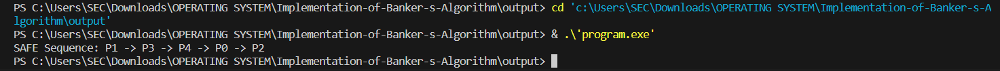

# OS-EX.8-IMPLEMENTATION-OF-BANKER-S-ALGORITHM
## AIM:
To write a C program to implement Bankers Algorithm to avoid Deadlock.
## ALGORITHM:
1: Get the no of processes.

2: Get the process numbers.

3: Get the no of resources types and instances of it.

4: Get Max demand of each process of n x m matrices.

5: Get the n x m matrices the number of resources of each type currently allocated to each
process.

6: Calculate the n x m of the remaining resource need of each process.

7: Initialize work as available resource and array of finish to false.

8: Check the Needed resource is lesser than the available resource if not display the System not
in safe state and if it is lesser than system in safe state.

9: Initialize work as sum of work and allocation, check if array of finish is true go to step 7
again if not go to step 8.

10: Check that request can be immediately granted.

11: If single request is lesser than or equal to available if true means arrive to new state.

12: Print the sequence if it is in safe state or print not in safe state. 

## PROGRAM:
```c
#include <stdio.h>
int main() {
    int numProcesses = 5; // Number of processes
    int numResources = 3; // Number of resources
    int allocationMatrix[5][3] = {{0, 1, 0}, {2, 0, 0}, {3, 0, 2}, {2, 1, 1}, {0, 0, 2}}; // Allocation Matrix
    int maxMatrix[5][3] = {{7, 5, 3}, {3, 2, 2}, {9, 0, 2}, {2, 2, 2}, {4, 3, 3}};   // MAX Matrix
    int availableResources[3] = {3, 3, 2}; // Available Resources
    int isFinished[numProcesses], safeSequence[numProcesses], index = 0;
    for (int k = 0; k < numProcesses; k++) {
        isFinished[k] = 0;
    }
    int needMatrix[numProcesses][numResources];
    for (int i = 0; i < numProcesses; i++) {
        for (int j = 0; j < numResources; j++)
            needMatrix[i][j] = maxMatrix[i][j] - allocationMatrix[i][j];
    }
    for (int k = 0; k < numProcesses; k++) {
        for (int i = 0; i < numProcesses; i++) {
            if (isFinished[i] == 0) {
                int flag = 0;
                for (int j = 0; j < numResources; j++) {
                    if (needMatrix[i][j] > availableResources[j]) {
                        flag = 1;
                        break;
                    }
                }
                if (flag == 0) {
                    safeSequence[index++] = i;
                    for (int y = 0; y < numResources; y++)
                        availableResources[y] += allocationMatrix[i][y];
                    isFinished[i] = 1;
                }
            }
        }
    }
    int flag = 1;
    for (int i = 0; i < numProcesses; i++) {
        if (isFinished[i] == 0) {
            flag = 0;
            printf("The system is not safe.\n");
            break;
        }
    }
    if (flag == 1) {
        printf("SAFE Sequence: ");
        for (int i = 0; i < numProcesses - 1; i++)
            printf("P%d -> ", safeSequence[i]);
        printf("P%d\n", safeSequence[numProcesses - 1]);
    }
    return 0;
}
```
## OUTPUT:

## RESULT:
Thus, implement Bankers Algorithm to avoid Deadlock is implemented successfully using c
program. 
